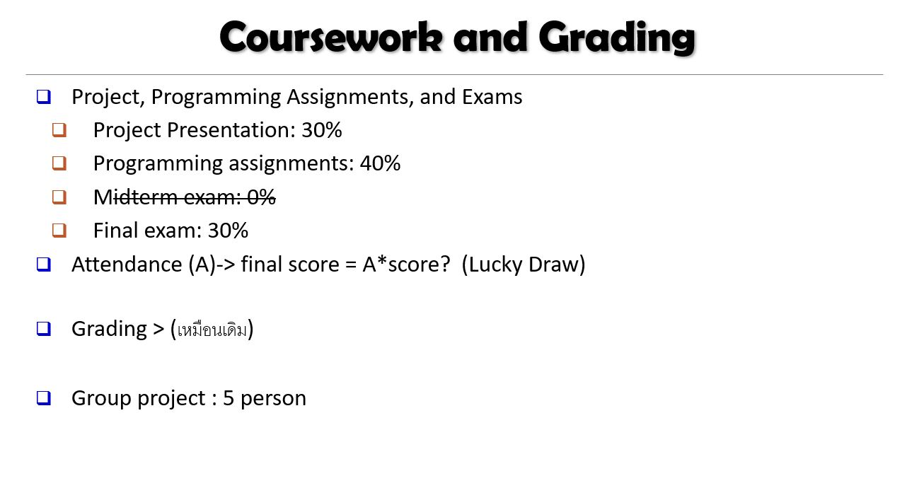

# DWDM21
# **Data Warehouse &amp; Data Mining 2021**

### ชื่อ : **อุมาพร คำภิชัย 623020547-0**

#### **กลุ่ม เทเลทับบี้**
#### **สมาชิกในกลุ่ม**
1. **นางสาวอุมาพร       คำภิชัย**
2. **นางสาวภัทรสร       เทพบุตร**
3. **นางสาวสุพิชญา      ตั้งกิจวานิชย์**
4. **นางสาวสุภาวดี       คำทุย**
5. **นางสาวพลอยบงกช   แสงโทโพธิ์**

## **สารบัญเนื้อหา**

* สรุปเนื้อหาบทที่ 1 [Introduction](https://github.com/Umaporn19/DWDM21/blob/main/%E0%B8%AA%E0%B8%A3%E0%B8%B8%E0%B8%9B%20Chapter%201.pdf)
  * Data Warehouse คืออะไร
  * Data Mining คืออะไร 
  * ทำไมต้องทำ Data Mining
  * ตัวอย่างข้อมูล
  * การเรียกชื่ออื่น ๆ 
  * ลักษณะภาพรวม
  * ขั้นตอนการทำข้อมูล
  * หัวข้อที่จะเรียน
  
* สรุปเนื้อหาบทที่ 2 [Getting to Know Your Data](https://github.com/Umaporn19/DWDM21/blob/main/%E0%B8%AA%E0%B8%A3%E0%B8%B8%E0%B8%9B%20Chapter%202.pdf)
  * ลักษณะภาพว่าแต่ละมิติแตกต่างกันอย่างไร
  * ลักษณะข้อมูล EX ข้อมูลเป้นกราฟ , วิดีโอ
  * ชนิดของข้อมูล
  * คุณสมบัติที่สำคัญ
  * ชนิดของ Attribute
  * การนำค่าสถิติเข้ามาเกี่ยวข้อง    
*  สรุปเนื้อหาบทที่ 2 เพิ่มเติม [Getting to Know Your Data เพิ่มเติม](https://github.com/Umaporn19/DWDM21/blob/main/%E0%B8%AA%E0%B8%A3%E0%B8%B8%E0%B8%9B%20Chapter%202%20(%E0%B8%95%E0%B9%88%E0%B8%AD).pdf)
    * สูตรในการคำนวณต่าง ๆ
*  สรุปเนื้อหาบทที่ 3 [Data Preprocessing](https://github.com/Umaporn19/DWDM21/blob/main/%E0%B8%AA%E0%B8%A3%E0%B8%B8%E0%B8%9B%20Chapter%203.pdf)
   * Data Preprocessing คืออะไร
   * ขั้นตอนในการทำ Data Preprocessing
   * ทำไมถึงต้องทำ Data Preprocessing
   * Data Cleaning คืออะไร
   * เพราะเหตุใดข้อมูลจึงไม่สมบูรณ์
   * ตัวเลือกในการจัดการกับค่า Missing
* สรุปเนื้อหาบทที่ 4 [Data Warehousing and On-line Anaalytical Processing](https://github.com/Umaporn19/DWDM21/blob/main/%E0%B8%AA%E0%B8%A3%E0%B8%B8%E0%B8%9B%20Chapter%204%20%E0%B9%80%E0%B8%9E%E0%B8%B4%E0%B9%88%E0%B8%A1%E0%B9%80%E0%B8%95%E0%B8%B4%E0%B8%A1.pdf)
   * Data Warehousing คืออะไร
   * OLTP & OLAP
   * ทำไมถึงต้องแยก Data Warehousing
   * โมเดล ทั้ง 3 แบบของ Data Warehousing
   * Meta Data
   * การสร้างแบบจำลองแนวคิดของ Data Warehousing ว่ามีแบบไหนบ้าง แต่ละแบบเป็นอย่างไร
   * ลักษณะข้อมูลในหลายมิติเป็นอย่างไร
   * การใช้ data warehouse ทั้งหมด 3 ประเภท 
* สรุปเนื้อหาบทที่ 6 [Mining Frequent Patterns, Association and Correlations:Basic Concepts and Methods](https://github.com/Umaporn19/DWDM21/blob/main/%E0%B8%AA%E0%B8%A3%E0%B8%B8%E0%B8%9B%20Chapter%206%20%E0%B9%80%E0%B8%9E%E0%B8%B4%E0%B9%88%E0%B8%A1%E0%B9%80%E0%B8%95%E0%B8%B4%E0%B8%A1.pdf)
   * Basic Concepts
   * Patterns หมายถึงอะไร ทำไมมันถึงสำคัญ
   * ตัวอย่าง K-Itemsets
   * การหาค่าต่าง ๆ ของ K-Itemsets
   * The Apriori Algorihm
   * ตัวอย่าง The Apriori Algorihm
* สรุปเนื้อบทที่ 8 [Classification:Basic Concepts](https://github.com/Umaporn19/DWDM21/blob/main/%E0%B8%AA%E0%B8%A3%E0%B8%B8%E0%B8%9B%20Chapter%208%20%E0%B9%80%E0%B8%9E%E0%B8%B4%E0%B9%88%E0%B8%A1%E0%B9%80%E0%B8%95%E0%B8%B4%E0%B8%A1.pdf) 
   * ลักษณะการสร้างโมเดลแบบมีผู้สอน 
   * ลักษณะการสร้างโมเดลแบบไม่มีผู้สอน
   * การทำนายปัญหา ระหว่าง Classification กับ การใช้ ทำนายตัวเลข
   * การสร้างโมเดลแบบจำลอง
   * Decision Tree ต้นไม้ตัดสินใจ
   * หลักการสร้างตาราง
   * ตัวอย่างในการหาค่าต่าง ๆ 
   * Gini Index
   * การหาค่า Gini
   * Naive Bayes Classfier 
   * Linear Regreesion 
  
  
  ## สารบัญในส่วน Github
  
* บทที่ 2 [Data101(Chapter2)](https://github.com/Umaporn19/DWDM21/blob/main/Data101(Chapter2).ipynb)
  * ไฟล์ .csv (cav คือ comma separated values) เป็นไฟล์หลักที่เราได้ใช้เรียนกันในวิชานี้
  * Basic Python
  * Casting int () float () str ()
  * Data Structure 
  * วิธีสร้าง list ว่าง
  * เติมค่าลงไปใน list ใช้ (.append)
  * การชี้ค่าใน list (indexing)
  * list slicing การตัดลิสต์
  * [จุดเริ่มต้น:จุดสุดท้าย :step]
  * list + list
  * format string
  * Loop
  * Nested loop ลูบซ้อนลูบ
  * Condition (if statement)
  * Quiz 1 หา max
  * เฉลย Quiz 1
  * การบ้านที่ 3 หาเกรด
  * Function
  * ลักณะตัวอย่าง (ไม่มี input)
  * ลักษณะตัวอย่างที่ (ไม่มี output)
  * ลักษณะตัวอย่าง (ไม่มี input และ output)
  * ลักษณะของ input (พารามิเตอร์)
  * Quiz ครั้งที่ 2 (27 ก.ค. 64)
* บทที่ 2 [Data102_(Chapter2)](https://github.com/Umaporn19/DWDM21/blob/main/Data102_(Chapter2).ipynb)
  * Nan = not a Number (ช่องว่าง)
  * คำสั่ง .head() .tail()
  * Box plot
  * Time Series Plot
* บทที่ 2 [Data_Preprocessing_(Chapter_3)](https://github.com/Umaporn19/DWDM21/blob/main/Data_Preprocessing_(Chapter_3).ipynb)
  * Meta Data (Data ที่ใช้อธิบาย Data)
  * ชี้ข้อมูลในตาราง
  * ชี้แบบ .iloc[] (มองข้อมูลแบบ matrix)
  * Missing Values
  * Handling Misiing Value 1 (ลบค่า missing ออกไป)
  * Quiz 3 ให้หาว่าการทำ dropna() ทำให้ข้อมูลหายไปกี่ %
  * Handling Misiing Value 1.5 (ลบค่า missing เฉพาะในคอลัมม์ที่เราสนใจออกไป)
  * Quiz 3.1 ให้หาว่าการทำ dropna() แบบเลือก drop เฉพาะคอลลัมม์ที่เราสนใจ (age) ทำให้ข้อมูลหายไปกี่ %
  * Handling Misiing Value 2 (แทนค่าด้วย class ใหม่ (unknown))
  * Handling Misiing Value 3 (แทนค่าด้วย class ใหม่ (ค่าที่เหมาะสม)
  * Handling Misiing Value 4 (แทนค่าด้วย ค่ากลาง)
  * Handling Misiing Value 5 (แทนค่าด้วย ค่ากลางของ sample ใน class เดียวกัน)
  * Select data by values [PD] คำสั่งแพนด้า
  * ขั้นตอนสร้าง list ของ boolen
  * สร้าง list ของ boolen
  * Quiz 4 + การบ้าน
  * ต่อตารางแนวแกน Y [PD]
  * การเรียงข้อมูล [PD]
  * Outlier
  * Quiz 5
  * Quiz กลุ่ม 
  * การรวมตาราง (ต่อตารางในแนวแกน x) Data Integration
  * รวม 2 ตาราง (.merge())
  * เอาเฉพาะคอลลัมม์ที่เราต้องการมาแปะ (.map())
  * ข้อควรจำ
  * Project กลุ่ม
  * Group by (pandas)
  * การบ้าน + ควิซ
  * [PD] save ตารางเอาไปใช้ที่อื่น
  * [PD] การสร้างตาราง
 
        
    

